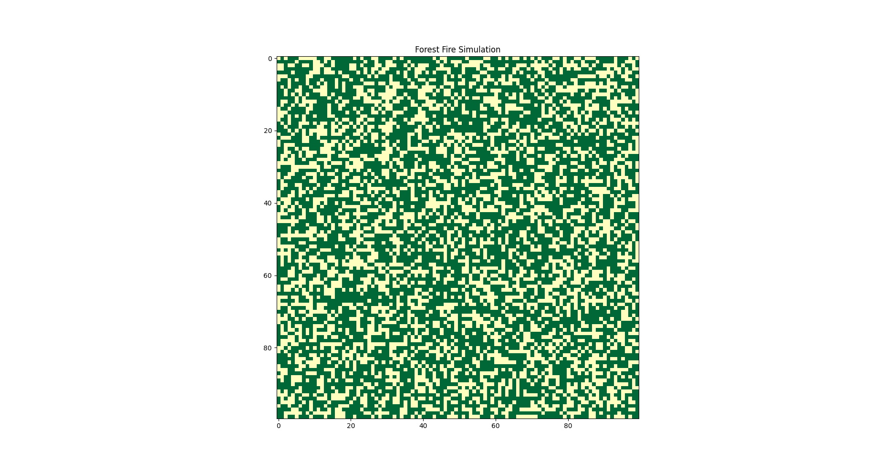

# Forest Fire – Cellular Automata

A cellular automaton simulates the propagation of forest fires based on simple, local rules on a grid.

## What it is

Each cell can be:

* `0` – empty
* `1` – tree
* `2` – burning

Each step:

* Burning trees become empty.
* Trees next to fire catch fire.
* Trees randomly ignite (lightning).
* Empty cells can grow new trees.

## Parameters

* **Size** – size of grid (e.g. 100×100)
* **p_tree** – initial density of trees
* **f** – lightning strike probability
* **p** – probability of regrowth
* **Steps** – number of simulation steps

## Results

Anomation of the simulation shows the spread of fire and regrowth of trees over time.

## Insights

* Simple rules can generate realistic dynamic behaviors.
* System never settles into a static state – mimics natural disturbances.
* Useful for modeling ecosystems, disease spread, or traffic systems.
