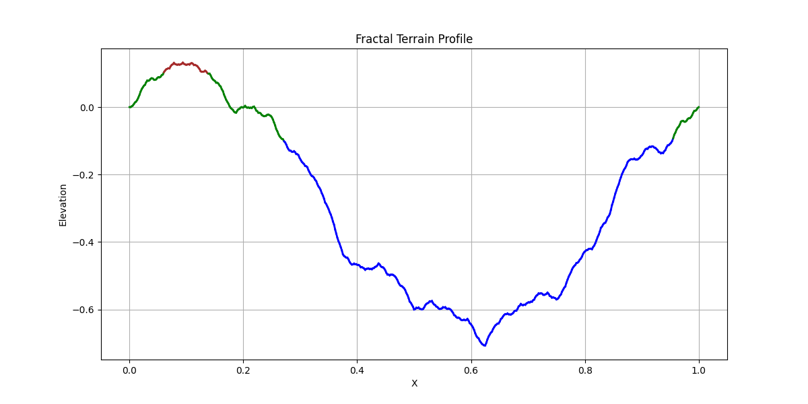

# Fractal Landscape Generation

Fractal landscapes are procedurally generated terrains that mimic the appearance of natural landscapes using recursive subdivision techniques and fractal noise.

## What it is

Fractal geometry can simulate realistic terrains by repeatedly subdividing a space and introducing random displacements. These displacements decrease over time to create a smooth but detailed terrain profile.

In 2D, this process involves recursively splitting lines and offsetting midpoints vertically, resulting in complex yet realistic landscapes.

## Components and Parameters

### Parameters

- **Initial Line** – starting straight line segment.
- **Perturbation Size** – initial amount of vertical random offset.
- **Decay Factor** – reduction of perturbation each recursion step.
- **Probability** – 50% chance whether the midpoint shifts upward or downward.
- **Recursion Depth** – number of subdivision levels.
- **Terrain Levels** – minimum three different terrain height categories (e.g., sea, plain, mountain).

### Functions (components)

- **Subdivide Line** – splits each line segment, perturbs midpoint, and recursively processes segments.
- **Assign Terrain Types** – maps different elevation ranges to distinct terrain types or colors.
- **Visualization** – plots the final 2D terrain profile with different colors representing terrain types.

## Code Structure

- `FractalTerrain` class:
    - `subdivide()` – recursively splits and perturbs the terrain line.
    - `generate()` – creates the entire terrain.
    - `classify_terrain()` – assigns colors or labels to segments.
    - `run()` – runs generation and displays the result.

## Visualization

- The final terrain is visualized as a continuous line.
- Different elevation zones are color-coded to represent multiple terrains (e.g., water, land, mountains).

## Results

Example of a generated fractal terrain with three distinct elevation levels:

You can see smooth hills, sharp peaks, and flat valleys emerging naturally from the recursive noise process.

## Insights

- Increasing recursion depth adds more details and complexity to the terrain.
- Reducing perturbation at each subdivision step ensures overall smoothness.
- Small random perturbations at each level lead to highly realistic terrain profiles.
- Fractal noise techniques effectively simulate natural landscapes with minimal code.

