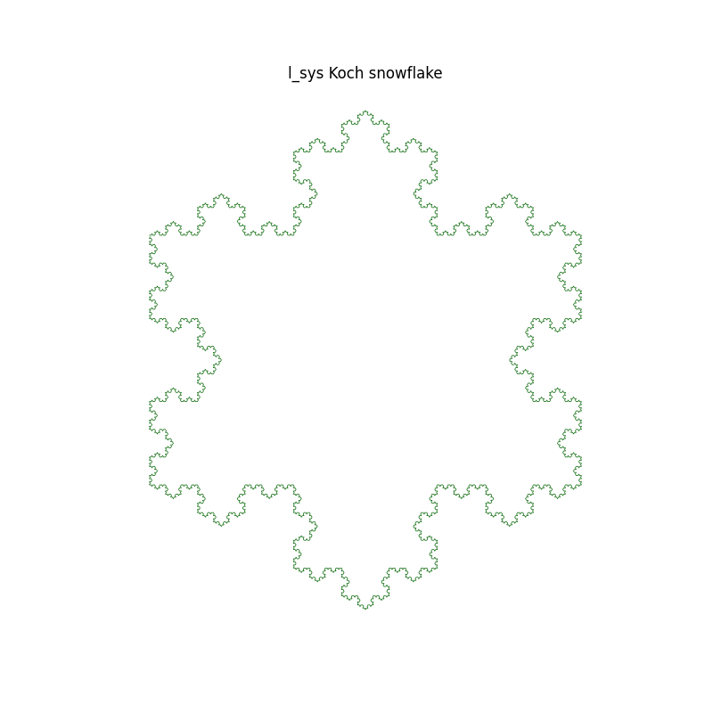

# L-systems

L-systems are formal grammars used to simulate the growth of natural patterns
like plants or fractal structures.

## What it is

An L-system consists of an initial string (axiom) and a set of production rules.
These rules are applied iteratively to grow the string into a complex structure.
The resulting string can be interpreted as drawing commands (e.g., turtle graphics) to visualize
fractals or branching structures.

## Components and Parameters

### Parameters

- **Axiom** – starting string
- **Rules** – substitution rules applied to each character (e.g., `F → F+F−F−F+F`)
- **Iterations** – number of times the rules are applied

### Functions (components)

- **Generate** – builds the string by repeatedly applying rules
- **Genetic Encoding** – rules can be encoded into arrays for optimization (e.g., using genetic algorithms)
- **Visualization** – the final string is interpreted as drawing instructions

## Results

- The structure is visualized as a set of 2D lines based on the final L-system string.

A simple L-system generating a branching plant-like shape:

Fractal tree is a classic example of an L-system, resembling a branching structure.

Koch Snowflake is a fractal that resembles a flower or a plant.

Pythagorean tree is a fractal constructed from squares and right triangles.

You can observe how small changes in rules result in completely different outcomes.
The number of iterations strongly influences detail and complexity.

## Insights

- More iterations really fast increase visual complexity.
- Rule variation leads to radically different fractal forms.
- Genetic algorithms help discover aesthetically interesting shapes.