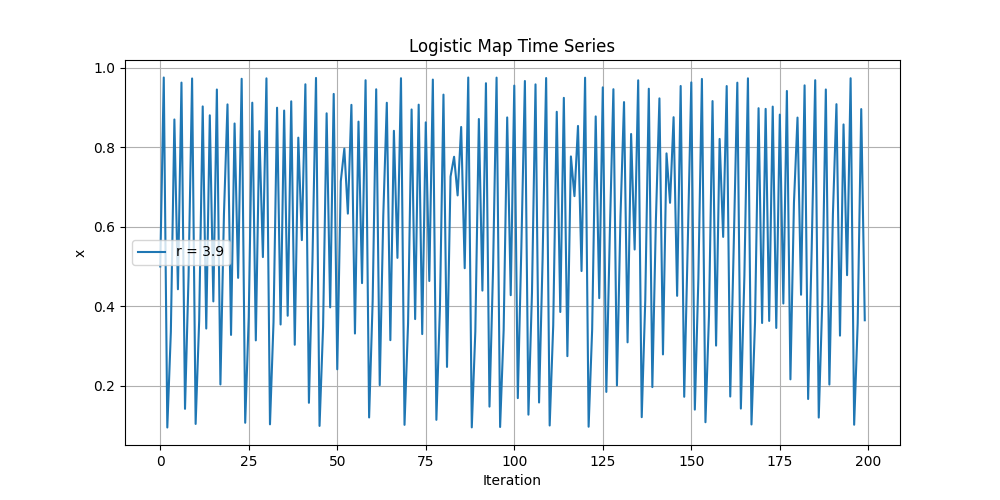
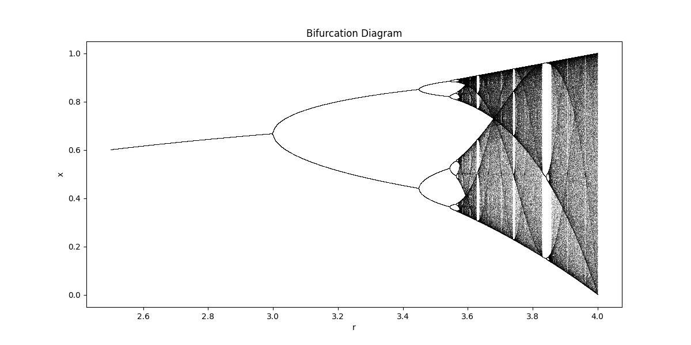
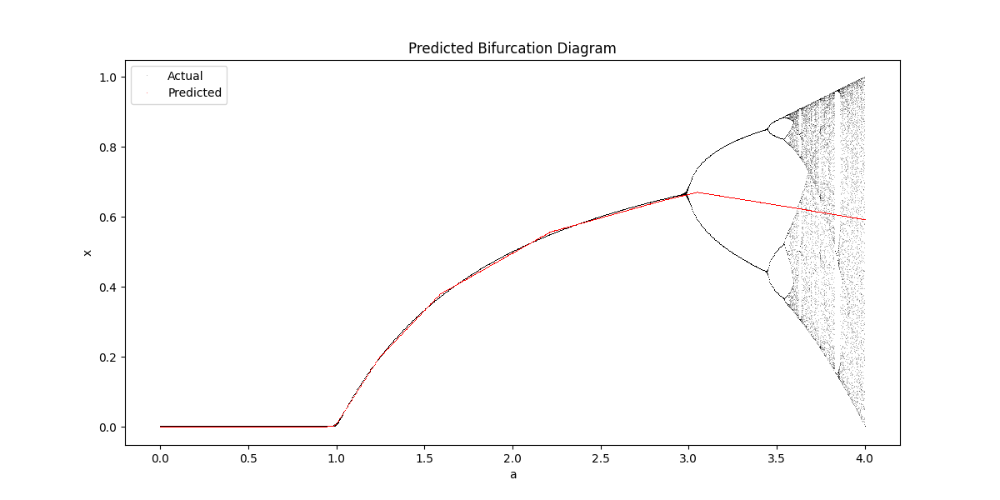

# Logistic Chaos

The logistic map is a simple nonlinear recurrence relation that shows how complex, chaotic behavior can arise from very simple nonlinear dynamical equations.
The model is extended by training a neural network to predict future values of the logistic map based on the parameter $a$.

## What it is

The logistic map is defined by:

$x_{n+1} = a x_n (1 - x_n)$

This recursive function exhibits different behaviors depending on the parameter $a$:

* Stable fixed point
* Periodic oscillations
* Chaos and bifurcations

## Components and Parameters

* **a** – control parameter ranging from 0 to 4
* **x0** – initial value (commonly 0.5)
* **Iterations** – number of samples per parameter value
* **Burn-in** – initial iterations to discard transient behavior

## Functions

### Logistic Map Implementation

* `logistic_map(x, a)` – defines the recurrence relation.
* `generate_bifurcation_data()` – generates data pairs $(a, x)$ after burn-in.

### Visualization

* `plot_bifurcation(data)` – plots the bifurcation diagram.

### Neural Network Prediction

* `train_neural_network(data)` – trains a simple MLP on $a \rightarrow x$ pairs.
* `predict_bifurcation(model)` – uses the trained model to generate predicted bifurcation diagram.

## Results

Time series example:

Bifurcation diagram:

Bifurcation diagram with neural network prediction:

## Insights

* Sensitive to initial conditions – tiny differences can diverge drastically.
* The system becomes unpredictable for certain values of $a$.
* Bifurcation diagram is a hallmark of deterministic chaos.
* A neural network can learn the chaotic response curve reasonably well, but in parts where it's more than one option to follow, it fails to predict.
* Training a neural network on the logistic map is taking forever.
