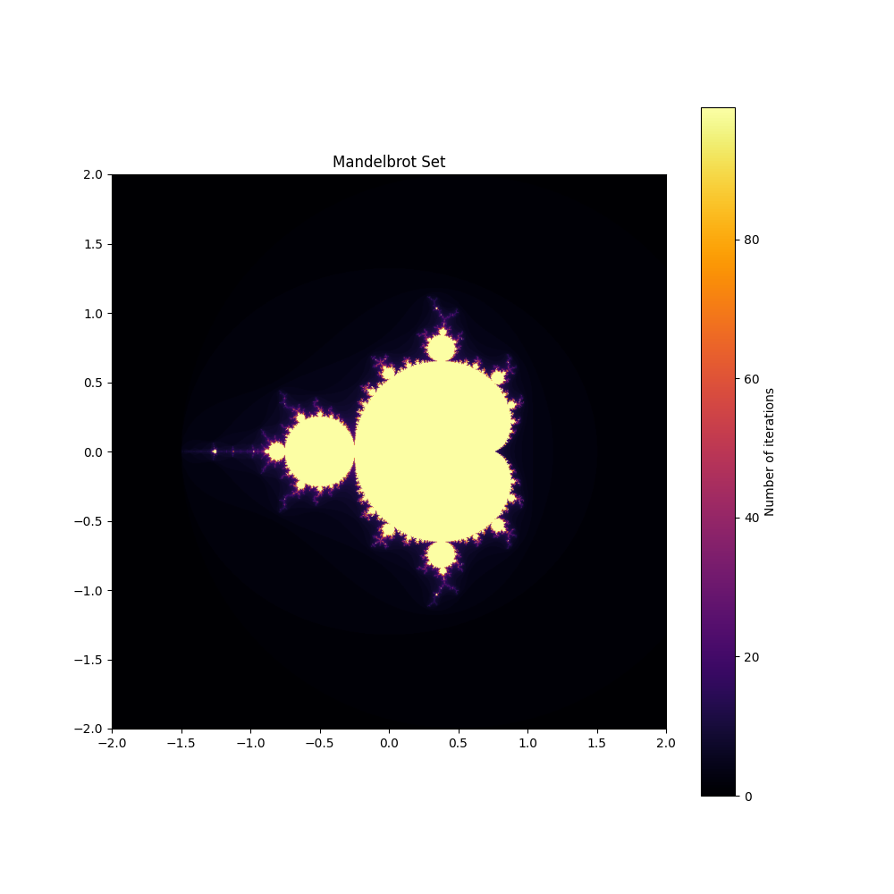
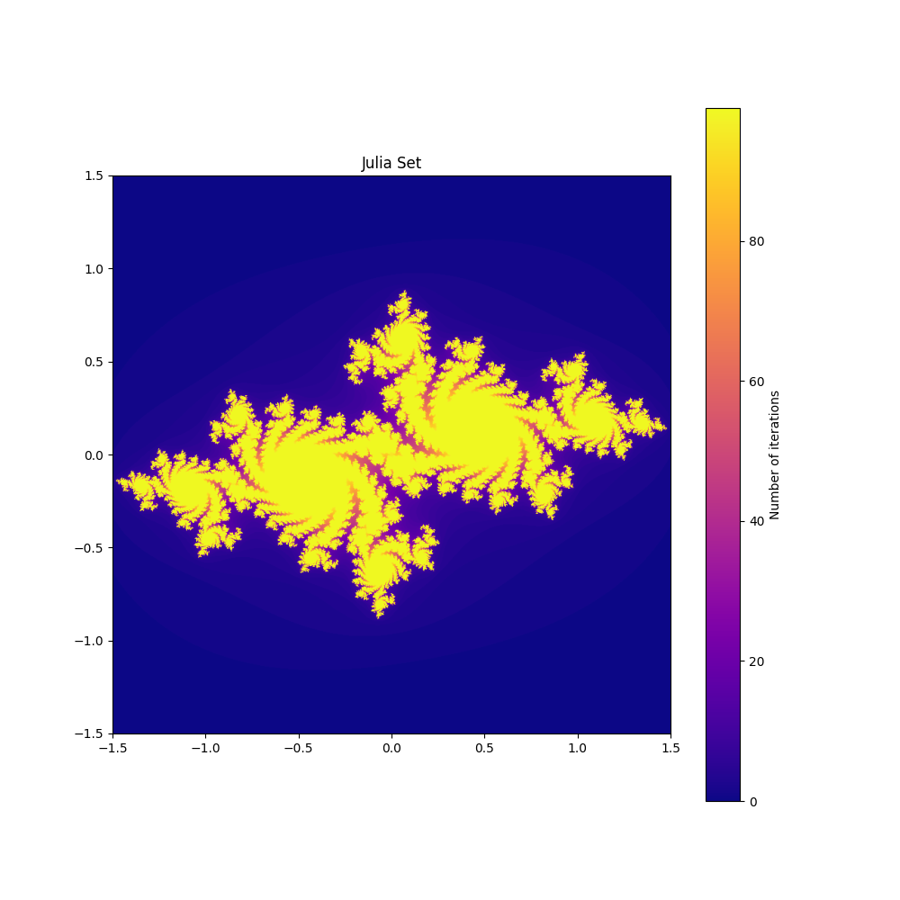

# Mandelbrot and Julia Sets

Mandelbrot and Julia sets are famous examples of fractal geometry, showcasing infinite complexity generated by simple iterative rules on complex numbers.

## What it is

The Mandelbrot set consists of all complex numbers \( c \) for which the sequence \( z_{n+1} = z_n^2 + c \), with \( z_0 = 0 \), remains bounded (does not tend to infinity). Similarly, Julia sets use a fixed complex number \( c \) and iterate \( z \) to explore stability and chaotic behavior.

The boundedness condition is checked using a real value \( m = 2 \): if \( |z_n| \leq 2 \) for all \( n \), the point belongs to the set.

## Components and Parameters

### Parameters

- **Grid Range**
    - Mandelbrot: \( X \in [-2, 1], \quad Y \in [-1, 1] \)
    - Julia: \( X \in [-1.5, 1.5], \quad Y \in [-1.5, 1.5] \)
- **Max Iterations** – the maximum number of iterations to decide boundedness
- **Zoom** – scaling factor to zoom into fractal details
- **Center Position** – center point of the fractal for zooming
- **Constant \( c \)** – fixed complex number used in Julia sets

### Functions (components)

- **Generate** – computes the fractal by iterating over a grid of complex numbers
- **Visualization** – displays fractal using iteration depth mapped to a color map (e.g., hue color mapping)
- **Zooming** – enables magnifying interesting fractal regions

## Code Structure

- `MandelbrotSet` class:
    - `generate_fractal("mandelbrot")` – calculates Mandelbrot or Julia set
    - `run()` – generates and visualizes

## Visualization

- The fractals are rendered as color maps where color represents how fast a point escapes (number of iterations).
- Mandelbrot set focuses on external complex numbers.
- Julia set illustrates internal behavior depending on \( c \).
- Zooming allows deeper exploration into infinite fractal structures.

## Results

Mandelbrot Set:

Julia Set:

These images show the amazing self-similar and infinitely detailed structure of fractals generated by simple iterative rules.

## Insights

- Small changes in the constant \( c \) lead to dramatically different Julia sets.
- Zooming into the Mandelbrot set reveals complex repeating patterns.
- Using more iterations improves detail but increases computational cost.
- Its magical how simple calculations and iterations can create such intricate and beautiful structures.

