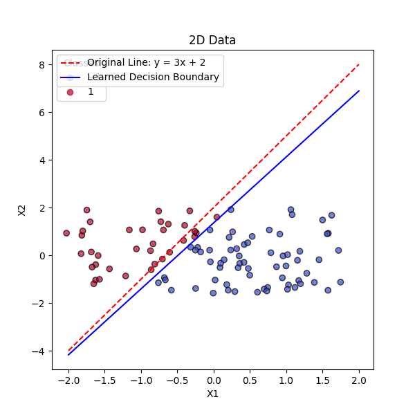

# Perceptron

Is simple neuron for binary classification. It is a base brick for neural networks.

## WHat it is

The perceptron is a fundamental type of artificial neuron used for binary classification.
It operates as a linear classifier, meaning it can only solve linearly separable problems.

## Components and Parameters

### Parameters

- Learning rate (η) - controls the step size during weight updates
- Epochs - number of iterations over the training dataset
- Weights (w) - parameters that the perceptron learns during training to fit the data
- Bias (b) - an additional parameter that allows the model to fit the data better by shifting the decision boundary

### Pipeline

- Initialization - starts woth ranodm weights and bias
- Training - predicted output is compared with the actual output and based on error difference weights are optimized
- Prediction - predicts a label class based on the weighted sum of inputs
- Decison boundary - perceptron forms a decision boundary which is straiht line (in 2D)
    - x_2 = -(w_1 * x_1 + b) / w_2

## Results

Graph of original Decision boundary and learned decision boundary.

Learned decision boundary probably never will be perfect, but it is close enough to the original one.
Dots are classified by learned boundary.
