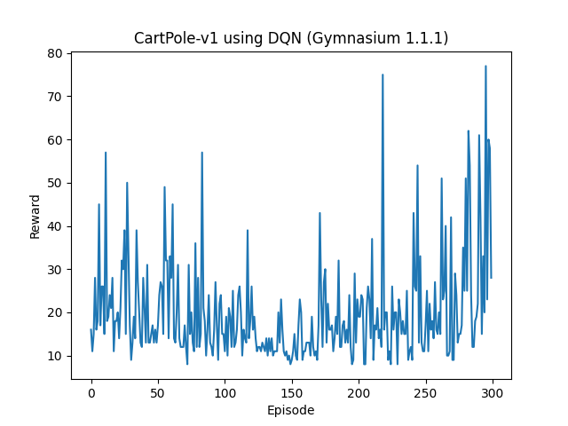
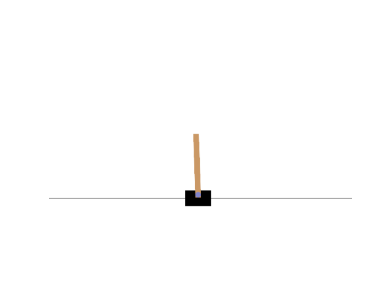

# Pole Balancing

This task implements a Deep Q-Learning agent to solve the CartPole balancing problem using **Gymnasium 1.1.1**.

## What it is

The CartPole problem consists of a cart on a 1D track with a pole hinged to its top. The goal is to apply left or right forces to keep the pole upright.

This is a classic reinforcement learning environment where the agent must learn to balance the pole using trial and error.

## Environment

* **State space** – 4 continuous values:
    * Cart position
    * Cart velocity
    * Pole angle
    * Pole angular velocity
* **Action space** – Discrete (2 values):

    * `0`: Move cart to the left
    * `1`: Move cart to the right

## Agent: Deep Q-Network (DQN)

A feedforward neural network is trained to approximate the Q-value function.

## Training

1. Initialize the environment and DQN agent.
2. For each episode:

    * Reset the environment and get initial state
    * Run the episode for up to 500 timesteps
    * Select action with epsilon-greedy strategy
    * Store experience into memory
    * Replay minibatch from memory to train the agent

### Visualization:

A line plot of the episode reward is shown after training to evaluate learning performance.

## Results

* After several hundred episodes, the agent learns to consistently balance the pole.
* Epsilon decays to 0.01, reducing exploration.
* Agent converges to long episode durations (> 400 timesteps).

## Output

Graph showing score over time.

Animation of the agent balancing the pole.

## Insights

* DQN is sufficient for simple environments like CartPole.
* It would be interesting to explore more complex environments like MountainCar or LunarLander.
* Replay memory and epsilon-greedy strategy stabilize learning.
* It would be great to reuse the trained model for further tasks.