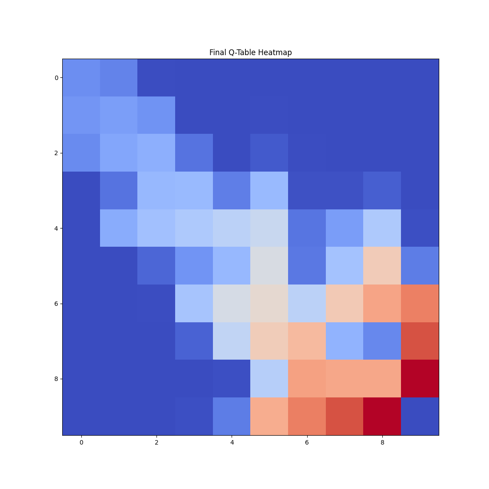
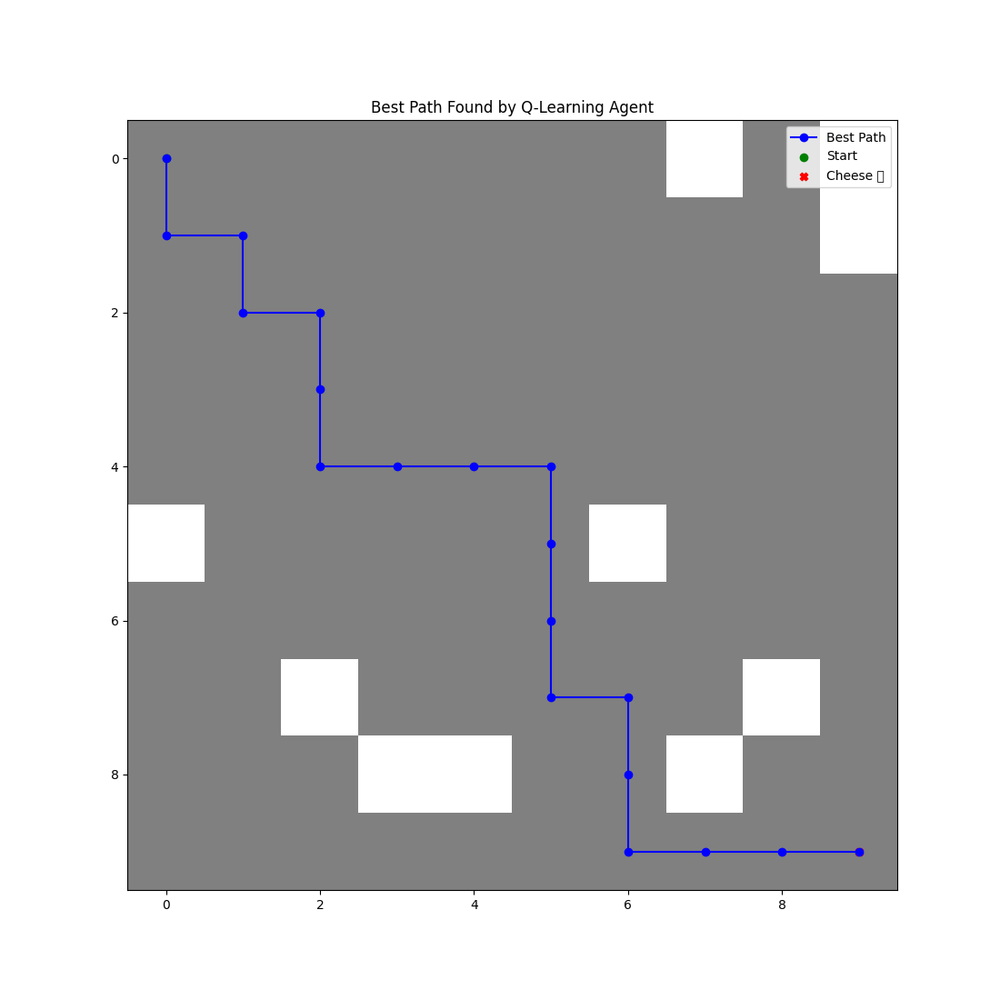

# Q learning

Also known as find the cheese.

## What it is

Q-learning is reinforcement learning algorithm where an agent
learns how to navigate grid based enviroment to reach a goal while avoiding obstacles.
It does this by Q-table which stores expected revards for taking actions in specific states.

## Components and Parameters

### Parameters

- grid_size - Tuple defining the grid dimensions (width × height).
- alpha - Learning rate (0.1 in this case). Determines how much the Q-values update after each step. Higher values mean faster learning but more instability.
- gamma - Discount factor (0.9). Controls how much future rewards influence the current decision. Closer to 1 means the agent prioritizes long-term rewards.
- epsilon - Exploration rate (0.1). Defines the probability of selecting a random action (exploring) instead of the best-known action (exploiting).
- episodes - Number of training episodes. More episodes mean better learning but higher computational cost.
- obstacles - Number of obstacles in the maze, affecting difficulty.

### Workflow

- Initialization - initialize qtable with zeros and generate random obstacles with start and finish points
- Training - for each episode:
    - The agent starts at the initial position (self.start).
    - It selects an action using an ε-greedy policy:
        - With probability ε (exploration rate), it selects a random action (explore).
        - Otherwise, it selects the action with the highest Q-value in the current state (exploit).
    - The action is executed, transitioning to a new state (step method).
    - The Q-value of the state-action pair is updated using the Q-learning update rule (which is kinda complicated to print into readme)
    - The process continues until the agent reaches the goal.

## Results

Start is always in left top corner and goal is always in right bottom corner.

Randomly generated maze (red color is walls and blue is free path).

Heatmap of Q-table after training. The values represent the expected rewards for each action in each state. More intense colors indicate higher expected rewards.

Path taken by the agent to reach the goal after training. 
